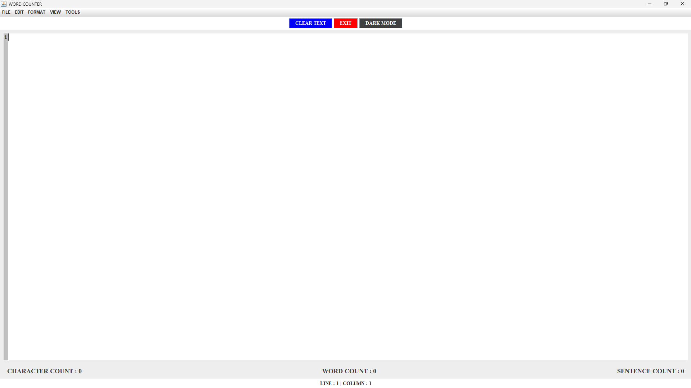
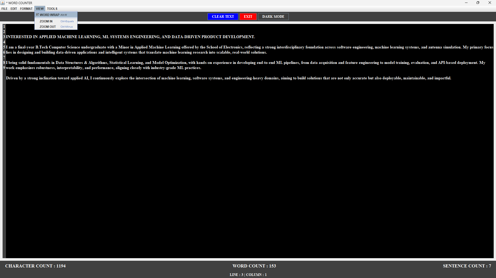
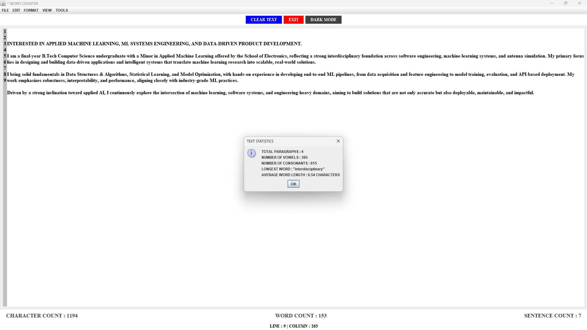

# 📝 ADVANCED JAVA TEXT EDITOR

  
  
  
  
    
  
  

<h1 align="center">MODULAR TEXT EDITOR & REAL-TIME ANALYTICS</h1>

> 
<b>WRITE SMARTER. ANALYZE FASTER. BUILT FROM SCRATCH.</b>

A PRODUCTION-GRADE, FEATURE-RICH DESKTOP TEXT EDITOR BUILT ENTIRELY IN **JAVA SWING**. THIS PROJECT GOES BEYOND STANDARD EDITORS BY INTEGRATING **REAL-TIME DOCUMENT ANALYTICS**, NON-DESTRUCTIVE **FIND & REPLACE**, AND EXPORT CAPABILITIES—ALL WRAPPED IN A HIGHLY MODULAR, ENTERPRISE-LEVEL **MVC (MODEL-VIEW-CONTROLLER)** ARCHITECTURE.

**🚀 FULLY CROSS-PLATFORM & ZERO EXTERNAL DEPENDENCIES**

---

## 📖 TABLE OF CONTENTS

- [📝 ADVANCED JAVA TEXT EDITOR](#-advanced-java-text-editor)
   - [📖 TABLE OF CONTENTS](#-table-of-contents)
   - [📘 PROJECT OVERVIEW](#-project-overview)
   - [✨ KEY FEATURES](#-key-features)
      - [REAL-TIME DOCUMENT ANALYTICS](#real-time-document-analytics)
      - [NON-DESTRUCTIVE FIND & REPLACE](#non-destructive-find--replace)
      - [ADVANCED EDITOR CAPABILITIES](#advanced-editor-capabilities)
      - [MODERN UI/UX EXPERIENCE](#modern-uiux-experience)
   - [👁️ VISUAL SHOWCASE](#️-visual-showcase)
      - [1. CLEAN EDITING INTERFACE](#1-clean-editing-interface)
      - [2. DARK MODE & ZOOM](#2-dark-mode--zoom)
      - [3. DETAILED TEXT STATISTICS](#3-detailed-text-statistics)
   - [⚙️ SYSTEM ARCHITECTURE (MVC)](#️-system-architecture-mvc)
   - [🧱 TECH STACK](#-tech-stack)
   - [🏁 USAGE](#-usage)
   - [☁️ EXPORT & FILE I/O](#️-export--file-io)
   - [📈 CONCLUSION](#-conclusion)
   - [🚀 FUTURE WORK](#-future-work)
   - [📄 LICENSE](#-license)
   - [📦 INSTALLATION & RUN INSTRUCTIONS](#-installation--run-instructions)

---

## 📘 PROJECT OVERVIEW

WHILE MANY MODERN TEXT EDITORS RELY ON HEAVY WEB FRAMEWORKS LIKE ELECTRON, THIS PROJECT PROVES THAT HIGH-PERFORMANCE, LIGHTWEIGHT DESKTOP APPLICATIONS CAN STILL BE ACHIEVED USING PURE **JAVA SWING**.

THE SYSTEM ADDRESSES THE NEED FOR A LIGHTWEIGHT TOOL THAT NOT ONLY EDITS TEXT BUT PROVIDES DEEP STATISTICAL INSIGHTS INTO THE WRITTEN CONTENT. IT FEATURES A DECOUPLED **MVC ARCHITECTURE**, ENSURING THE UI (VIEW) IS COMPLETELY SEPARATED FROM THE BUSINESS LOGIC (CONTROLLER) AND EVENT LISTENERS (MODEL). THIS MAKES THE CODEBASE HIGHLY SCALABLE, READABLE, AND EASY TO MAINTAIN.

---

## ✨ KEY FEATURES

### REAL-TIME DOCUMENT ANALYTICS

- DYNAMICALLY CALCULATES **CHARACTER, WORD, AND SENTENCE COUNTS** INSTANTLY AS YOU TYPE.
- UTILIZES ADVANCED REGEX AND `HASHSET` FILTERING TO PREVENT ABBREVIATIONS (E.G., "MR.", "DR.") FROM SKEWING SENTENCE COUNTS.
- FEATURES A DEDICATED **TEXT STATISTICS TOOL** CAPABLE OF EXTRACTING VOWEL/CONSONANT COUNTS, PARAGRAPH METRICS, AVERAGE WORD LENGTH, AND THE LONGEST WORD USED.

### NON-DESTRUCTIVE FIND & REPLACE

- REPLACES STRINGS ITERATIVELY FROM THE BOTTOM OF THE DOCUMENT TO THE TOP USING `lastIndexOf`.
- SAFELY PRESERVES THE `UndoManager` HISTORY AND MAINTAINS THE USER'S EXACT CARET AND SCROLL POSITION (NO SCREEN JUMPING).
- VISUALLY HIGHLIGHTS ALL MATCHING OCCURRENCES USING A CUSTOM `HighlightPainter`.

### ADVANCED EDITOR CAPABILITIES

- **UNDO / REDO HISTORY:** FULL EDITING TIMELINE RECOVERY.
- **GO TO LINE:** INSTANTLY JUMP TO ANY LOGICAL LINE NUMBER WITHIN MASSIVE DOCUMENTS.
- **DYNAMIC WORD WRAP:** TOGGLE TEXT WRAPPING ON/OFF WITH A DEDICATED MENU CHECKBOX.
- **UNSAVED CHANGES TRACKER:** AUTOMATICALLY APPENDS AN ASTERISK (`*`) TO THE WINDOW TITLE THE MOMENT A DOCUMENT IS MODIFIED.

### MODERN UI/UX EXPERIENCE

- **DARK MODE INTEGRATION:** SEAMLESSLY INVERT UI COLORS TO REDUCE EYE STRAIN DURING NIGHT-TIME CODING OR WRITING.
- **DYNAMIC ZOOM:** USE `CTRL +` AND `CTRL -` TO DYNAMICALLY SCALE FONT SIZES ACROSS ALL COMPONENTS INSTANTLY.
- **LINE NUMBERING:** FEATURES A CUSTOM-BUILT, AUTOMATICALLY SYNCHRONIZING ROW HEADER TO TRACK DOCUMENT LENGTH.

---

## 👁️ VISUAL SHOWCASE

### 1. CLEAN EDITING INTERFACE

A MINIMALIST, HIGH-PERFORMANCE WINDOW SHOWCASING THE STATUS BAR AND LINE NUMBERS.

  

### 2. DARK MODE & ZOOM

EASILY TOGGLE THEMES AND SCALE FONTS USING ENCAPSULATED MENU ACTIONS.

  

### 3. DETAILED TEXT STATISTICS

THE CORE ANALYTICS ENGINE POP-UP DIALOG DELIVERING METRICS IN REAL-TIME.

  

---

## ⚙️ SYSTEM ARCHITECTURE (MVC)

TO AVOID THE "GOD CLASS" ANTI-PATTERN, THE APPLICATION IS SPLIT INTO **5 STRICTLY DEFINED MODULES**:

1. **`Main.java` (THE VIEW):** THE ENTRY POINT. IT STRICTLY HANDLES INITIALIZING THE `JFrame`, ASSEMBLING PANELS, AND EXPOSING UI COMPONENTS TO THE CONTROLLER.
2. **`EditorActions.java` (THE CONTROLLER):** HOUSES ALL `AbstractAction` IMPLEMENTATIONS. IT ACTS AS THE "BRAIN," ROUTING MENU CLICKS AND KEYBOARD SHORTCUTS TO THEIR RESPECTIVE FUNCTIONS.
3. **`EditorDialogs.java` (THE UTILITY):** OFF-LOADS ALL COMPLEX `JOptionPane`, `JFileChooser`, AND PRINTING LOGIC TO KEEP THE MAIN THREAD CLEAN.
4. **`DocumentAnalyzer.java` (THE MODEL):** LISTENS FOR KEYSTROKES, CALCULATES LIVE METRICS, REGEX PARSING, AND TRIGGERS UNSAVED CHANGE FLAGS.
5. **`LineNumberView.java` (CUSTOM COMPONENT):** EXTENDS `JTextArea` TO CREATE A SYNCHRONIZED ROW HEADER FOR VISUAL LINE COUNTING.

---

## 🧱 TECH STACK

| LAYER         | TECHNOLOGY USED                                                               |
| ------------- | ----------------------------------------------------------------------------- |
| **LANGUAGE** | JAVA (JDK 8 OR HIGHER RECOMMENDED)                                            |
| **UI KIT** | JAVA SWING & AWT (`JFrame`, `JTextArea`, `JMenuBar`, `JOptionPane`)           |
| **EVENTS** | `AbstractAction`, `DocumentListener`, `CaretListener`, `KeyStroke`            |
| **I/O** | `java.io.BufferedReader`, `BufferedWriter`, `File`, `FileWriter`              |
| **PRINTING** | `java.awt.print.PrinterJob`                                                   |

---

## 🏁 USAGE

1. **EDITING**
   - START TYPING TO SEE REAL-TIME CHARACTER, WORD, AND SENTENCE UPDATES IN THE BOTTOM PANEL.
2. **SHORTCUTS**
   - `CTRL + O` : OPEN FILE
   - `CTRL + S` : SAVE FILE
   - `CTRL + F` : FIND TEXT
   - `CTRL + R` : FIND & REPLACE
   - `CTRL + G` : GO TO LINE
   - `CTRL + I` : TEXT STATISTICS
   - `CTRL + D` : TOGGLE DARK MODE
   - `CTRL + +` / `CTRL + -` : ZOOM IN / ZOOM OUT
3. **FORMATTING**
   - USE THE `FORMAT` MENU TO CHANGE FONT FAMILY, SIZE, AND TEXT COLOR DYNAMICALLY.

---

## ☁️ EXPORT & FILE I/O

- **NATIVE SAVING:** READS AND WRITES STANDARD `.txt` FILES USING EFFICIENT BUFFERED STREAMS.
- **PDF EXPORT:** INTEGRATED `PrinterJob` API ALLOWS USERS TO EXPORT THEIR FORMATTED DOCUMENTS DIRECTLY TO THE OS PRINT DIALOG (SUPPORTING "PRINT TO PDF" FUNCTIONALITY).

---

## 📈 CONCLUSION

THIS PROJECT DEMONSTRATES ADVANCED OBJECT-ORIENTED PROGRAMMING (OOP) PRINCIPLES AND UI THREAD MANAGEMENT. BY DECOUPLING THE EVENT LISTENERS FROM THE GUI RENDERING, THE APPLICATION ACHIEVES HIGH PERFORMANCE WITHOUT MEMORY LEAKS OR UI FREEZING, EVEN WHEN PROCESSING LARGE TEXT FILES.

---

## 🚀 FUTURE WORK

- **MULTIPLE TABS (`JTabbedPane`):** EXTENDING THE UI TO SUPPORT EDITING MULTIPLE FILES SIMULTANEOUSLY.
- **SYNTAX HIGHLIGHTING:** REPLACING `JTextArea` WITH `JTextPane` TO ADD DYNAMIC COLOR CODING FOR PROGRAMMING LANGUAGES.
- **AUTO-SAVE:** IMPLEMENTING A BACKGROUND `javax.swing.Timer` TO PERIODICALLY BACKUP THE DOCUMENT TO A HIDDEN TEMP FILE TO PREVENT DATA LOSS ON APP CRASH.

---

## 📄 LICENSE

THIS PROJECT IS LICENSED UNDER THE [MIT LICENSE](LICENSE).

YOU ARE FREE TO USE, MODIFY, AND DISTRIBUTE THIS PROJECT FOR PERSONAL AND COMMERCIAL PURPOSES WITH PROPER ATTRIBUTION.

---

## 📦 INSTALLATION & RUN INSTRUCTIONS

> 1. **CLONE THE REPOSITORY**

---

- `git clone https://github.com/DaRkSouL36/WORD-COUNTER`
- `cd "WORD-COUNTER"`

---

> 2. **COMPILE THE JAVA SOURCE FILES**

---

- BECAUSE THE APPLICATION IS BROKEN DOWN INTO MULTIPLE MODULAR FILES, YOU MUST COMPILE ALL OF THEM TOGETHER. OPEN YOUR TERMINAL OR COMMAND PROMPT IN THE PROJECT DIRECTORY AND RUN:
   
   `javac *.java`

- **NOTE:**

  THIS COMMAND COMPILES `Main.java`, `EditorActions.java`, `EditorDialogs.java`, `DocumentAnalyzer.java`, AND `LineNumberView.java` INTO `.class` BYTECODE FILES.

---

> 3. **RUN THE APPLICATION**

---

- ONCE COMPILED, START THE APPLICATION BY EXECUTING THE MAIN CLASS:

   `java Main`

- THE WORD COUNTER GUI WILL LAUNCH IMMEDIATELY.

---

<a href="#-advanced-java-text-editor">

<strong>RETURN</strong>
</a>

